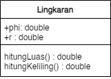
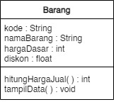

# Jobsheet 2 Object Oriented Programming - Class and Object

## Tugas

Suatu toko persewaan video game salah satu yang diolah adalah peminjaman, dimana data yang dicatat ketika ada orang yang melakukan peminjaman adalah id, nama member, nama game, dan harga yang harus dibayar. Setiap peminjaman bisa menampilkan data hasil peminjaman dan harga yang harus dibayar.

Penjelasan:
- Harga yang harus dibayar diperoleh dari lama sewa x harga.
- Diasumsikan 1x transaksi peminjaman game yang dipinjam hanya 1 game saja.

Class Peminjaman

```java
public class Peminjaman {

    public String id;
    public String nama;
    public String namaGame;
    public int harga;

    public void tampilPeminjaman(){
        System.out.println("Id\t\t: " + id);
        System.out.println("Nama Member\t: " + nama);
        System.out.println("Nama Game\t: " + namaGame);
        System.out.println("Harga\t\t: " + harga);
    }

    public int hitungHarga(int lama, int hargaSewa){
        return lama * hargaSewa;
    }
}
```

Demo
```java
public class PeminjamanMain {
    public static void main(String[] args) {

        Peminjaman pj = new Peminjaman();
        pj.id = "0001";
        pj.nama = "Budi";
        pj.namaGame = "Zuma";
        pj.harga = pj.hitungHarga(24, 20000);
        pj.tampilPeminjaman();

    }
}
```

Hasil Running
```terminal
Id              : 0001
Nama Member     : Budi
Nama Game       : Zuma
Harga           : 480000
```
<br>

---
<br>
 Buatlah program sesuai dengan class diagram berikut ini:



Class Lingkaran
```java
public class Lingkaran {
    public double phi = 3.14;
    public double r;

    public double hitungLuas(){
        return phi*r*r;
    }
    
    public double hitungKeliling(){
        return 2*phi*r;
    }
}
```
Demo
```java
public class LingkaranMain {
    public static void main(String[] args) {
        Lingkaran l = new Lingkaran();
        l.r = 12;
        System.out.println("Jari-jari\t\t: " + l.r);
        System.out.println("Luas lingkaran\t\t: " + l.hitungLuas());
        System.out.println("Keliling lingkaran\t: " + l.hitungKeliling());
    }
}
```
Hasil Running
```terminal
Jari-jari               : 12.0
Luas lingkaran          : 452.15999999999997
Keliling lingkaran      : 75.36
```
<br>

---
<br>
 Buatlah program sesuai dengan class diagram berikut ini:



<br>

Deskripsi / Penjelasan:
- Nilai atribut hargaDasar dalam Rupiah dan atribut diskon dalam %
- Method hitungHargaJual() digunakan untuk menghitung harga jual dengan perhitungan berikut ini: harga jual = harga dasar – (diskon x harga dasar)
- Method tampilData() digunakan untuk menampilkan nilai dari kode, namaBarang, hargaDasar, diskon dan harga jual


Class Barang
```java
public class Barang {

    public String kode;
    public String namaBarang;
    public int hargaDasar;
    public float diskon;

    public int hitungHargaJual() {
        return (int) (hargaDasar - ((diskon / 100) * hargaDasar));
    }

    public void tampilData() {
        System.out.println("Kode\t\t: " + kode);
        System.out.println("Nama Barang\t: " + namaBarang);
        System.out.println("Harga Dasar\t: Rp" + hargaDasar);
        System.out.println("Diskon\t\t: " + diskon + "%");
        System.out.println("Harga Jual\t: Rp" + hitungHargaJual());
    }
}
```
Demo
```java
public class BarangMain {
    public static void main(String[] args) {
        Barang b = new Barang();
        b.kode = "001";
        b.namaBarang = "Buku";
        b.hargaDasar = 60000;
        b.diskon = 10;
        b.tampilData();
    }
}
```
Hasil Running
```terminal
Kode            : 001
Nama Barang     : Buku
Harga Dasar     : Rp60000
Diskon          : 10.0%
Harga Jual      : Rp54000
```
<br>

---
<br>

## Latihan

Jurusan Teknologi Informasi akan membangun system informasi pemberian nilai secara online kepada setiap mahasiswa yang menempuh perkuliahan. Setiap nilai mata kuliah yang akan dimasukkan dalam system di inputkan secara langsung oleh dosen yang bersangkutan. Dari system ini diharapkan mahasiswa akan lebih mudah untuk melakukan evaluasi terhadap setiap matakuliah yang sudah
pernah diikuti.

Class Dosen
```java
public class Dosen {
    String nip;
    String namaDs;
    
    Dosen(String nip, String namaDs){
        this.nip = nip;
        this.namaDs = namaDs;
    }

    String getNamaDs() {
        return namaDs;
    }

    String getNip() {
        return nip;
    }

}
```
Class Matakuliah
```java
public class MataKuliah {

    String kodeMk;
    String namaMk;
    int nilaiMK;

    MataKuliah(String kodeMk, String namaMk){
        this.kodeMk = kodeMk;
        this.namaMk = namaMk;
    }

    String getKodeMk() {
        return kodeMk;
    }

    String getNamaMk() {
        return namaMk;
    }

    int getNilaiMK() {
        return nilaiMK;
    }

}
```

Class Mahasiswa
```java
public class Mahasiswa {
    String nim;
    String namaMhs;
    MataKuliah[] mataKuliahs;

    Mahasiswa(String nim, String namaMhs, int mataKuliah){
        this.nim = nim;
        this.namaMhs = namaMhs;
        mataKuliahs = new MataKuliah[mataKuliah];
    }

    void printNilai(){
        for (int a = 0; a < mataKuliahs.length; a++) {
            System.out.println("Nilai "+mataKuliahs[a].getNamaMk()+" = "+mataKuliahs[a].getNilaiMK());
        }
    }

    String getNim(){
        return nim;
    }

    String getNamaMhs() {
        return namaMhs;
    }

}
```
Demo
```java
import java.util.Scanner;

public class Demo {
    public static void main(String[] args) {

        Scanner sc = new Scanner(System.in);
        Dosen[] dataDosen = new Dosen[5];

        dataDosen[0] = new Dosen("D001", "Doni");
        dataDosen[1] = new Dosen("D002", "Nana");
        dataDosen[2] = new Dosen("D003", "Cahya");
        dataDosen[3] = new Dosen("D004", "Lukman");
        dataDosen[4] = new Dosen("D005", "Andi");

        MataKuliah[] dataMk = new MataKuliah[4];

        dataMk[0] = new MataKuliah("MK01", "PBO");
        dataMk[1] = new MataKuliah("MK02", "Desain Web");
        dataMk[2] = new MataKuliah("MK03", "Manajemen Proyek");
        dataMk[3] = new MataKuliah("MK04", "Matematika");

        Mahasiswa[] dataMhs = new Mahasiswa[2];

        dataMhs[0] = new Mahasiswa("MHS1", "Ahmad", 4);
        dataMhs[1] = new Mahasiswa("MHS2", "Taufiq", 4);

        for (int a = 0; a < dataMhs.length; a++) {
            for (int b = 0; b < dataMk.length; b++) {
                dataMhs[a].mataKuliahs[b] = dataMk[b];
            }
        }

        boolean exit = false;

        do {

            System.out.println("1. Input Nilai");
            System.out.println("2. Lihat Nilai");
            System.out.println("3. Keluar");
            System.out.print("> Piih Menu: ");
            int pilih = sc.nextInt();
            switch (pilih) {
                case 1:

                    exit = false;

                    System.out.print("Masukkan NIP: ");
                    String nipTemp = sc.next();
                    sc.nextLine();

                    if (checkNip(dataDosen, nipTemp)) {
                        System.out.print("Masukkan NIM: ");
                        String nimTemp = sc.nextLine();
                        System.out.print("Masukkan Kode MK: ");
                        String kodeMkTemp = sc.nextLine();

                        if (checkNim(dataMhs, nimTemp)) {
                            int idMhs = findMhs(dataMhs, nimTemp);
                            if (checkKodeMk(dataMhs[idMhs].mataKuliahs, kodeMkTemp)) {
                                int idMk = findMk(dataMk, kodeMkTemp);
                                System.out
                                        .print("Masukkan Nilai " + dataMhs[idMhs].mataKuliahs[idMk].getNamaMk() + ": ");
                                dataMhs[idMhs].mataKuliahs[idMk].nilaiMK = sc.nextInt();
                            } else {
                                System.out.println("Mata Kuliah Tidak Ditemukan");
                            }
                        } else {
                            System.out.println("Mahasiswa Tidak Ditemukan");
                        }

                    } else {
                        System.out.println("NIP Tidak Ditemukan");
                    }

                    break;

                case 2:
                    exit = false;

                    System.out.print("Masukkan NIM: ");
                    String nimTemp = sc.next();
                    sc.nextLine();

                    if (checkNim(dataMhs, nimTemp)) {
                        int idMhs = findMhs(dataMhs, nimTemp);

                        dataMhs[idMhs].printNilai();

                    } else {
                        System.out.println("Mahasiswa Tidak Ditemukan");
                    }
                    break;
                case 3:
                default:
                    exit = true;
                    break;
            }
        } while (!exit);

    }

    static boolean checkNip(Dosen[] arr, String nip) {
        for (int a = 0; a < arr.length; a++) {
            if (arr[a].nip.equals(nip)) {
                return true;
            }
        }
        return false;
    }

    static boolean checkNim(Mahasiswa[] arr, String nim) {
        for (int a = 0; a < arr.length; a++) {
            if (arr[a].nim.equals(nim)) {
                return true;
            }
        }
        return false;
    }

    static int findMhs(Mahasiswa[] arr, String nim) {
        for (int a = 0; a < arr.length; a++) {

            if (arr[a].nim.equals(nim)) {
                return a;
            }
        }
        return -1;
    }

    static int findMk(MataKuliah[] arr, String kodeMk) {
        for (int a = 0; a < arr.length; a++) {
            if (arr[a].kodeMk.equals(kodeMk)) {
                return a;
            }
        }
        return -1;
    }

    static boolean checkKodeMk(MataKuliah[] arr, String kodeMk) {
        for (int a = 0; a < arr.length; a++) {
            if (arr[a].kodeMk.equals(kodeMk)) {
                return true;
            }
        }
        return false;
    }
}
```

Hasil Running
```terminal
1. Input Nilai
2. Lihat Nilai
3. Keluar
> Piih Menu: 1
Masukkan NIP: D002
Masukkan NIM: MHS01
Masukkan Kode MK: MK02
Mahasiswa Tidak Ditemukan
1. Input Nilai
2. Lihat Nilai
3. Keluar
> Piih Menu: 1   
Masukkan NIP: D002  
Masukkan NIM: MHS1  
Masukkan Kode MK: MK02 
Masukkan Nilai Desain Web: 90
1. Input Nilai
2. Lihat Nilai
3. Keluar
> Piih Menu: 2
Masukkan NIM: MHS1
Nilai PBO = 0
Nilai Desain Web = 90
Nilai Manajemen Proyek = 0
Nilai Matematika = 0
1. Input Nilai
2. Lihat Nilai
3. Keluar
> Piih Menu: 3
```