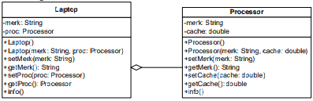
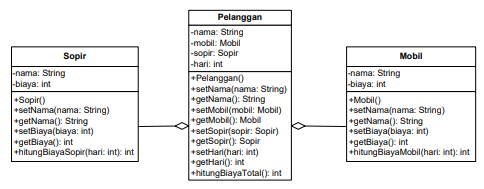
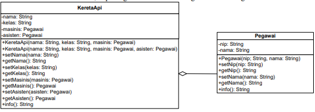
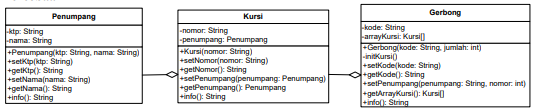

# Jobsheet 4 - Relasi Class

## Percobaan 1

Buatlah class dari UML berikut:<br>

<br>

Class Processor
```java
public class Processor{

    private String merk;
    private double cache;

    Processor(){

    }
    
    Processor(String merk, double cache){
        this.merk = merk;
        this.cache = cache;
    }

    public void setCache(double cache) {
        this.cache = cache;
    }

    public void setMerk(String merk) {
        this.merk = merk;
    }

    public double getCache() {
        return cache;
    }

    public String getMerk() {
        return merk;
    }

    public void info(){
        System.out.printf("Merk Processor = %s\n", merk);
        System.out.printf("Cache Memory = %.2f\n", cache);
    }
}
```

Class Laptop
```java
public class Laptop {
    private String merk;
    private Processor proc;

    Laptop(){
        
    }

    Laptop(String merk, Processor proc){
        this.merk = merk;
        this.proc = proc;
    }

    public void setMerk(String merk) {
        this.merk = merk;
    }

    public void setProc(Processor proc) {
        this.proc = proc;
    }

    public String getMerk() {
        return merk;
    }

    public Processor getProc() {
        return proc;
    }

    public void info(){
        System.out.println("Merk Laptop = " + merk);
        proc.info();
    }

}
```

Demo
```java
public class MainPercobaan1 {
    public static void main(String[] args) {
        Processor p = new Processor("Intel i5", 3);
        Laptop L = new Laptop("Thinkpad", p);

        L.info();

        Processor p1 = new Processor();
        p1.setMerk("Intel i5");
        p1.setCache(4);
        Laptop L1 = new Laptop();
        L1.setMerk("Thinkpad");
        L1.setProc(p1);
        L1.info();
    }
}
```

Hasil
```terminal
Merk Laptop = Thinkpad
Merk Processor = Intel i5
Cache Memory = 3.00
Merk Laptop = Thinkpad
Merk Processor = Intel i5
Cache Memory = 4.00
```

Pertanyaan<br>
1. Di dalam class ```Processor``` dan class ```Laptop``` , terdapat method setter dan getter untuk masing‑masing atributnya. Apakah gunanya method setter dan getter tersebut?<br>
**Jawab**:  Method setter berfungsi untuk memberikan value kepada atribut dan method getter berfungsi untuk mengembalikan nilai pada sebuah atribut.

2. Di dalam class ```Processor``` dan class ```Laptop```, masing‑masing terdapat konstruktor default dan konstruktor berparameter. Bagaimanakah beda penggunaan dari kedua jenis konstruktor tersebut?<br>
**Jawab**: Method setter berfungsi untuk memberikan value kepada atribut dan method getter berfungsi untuk mengembalikan nilai pada sebuah atribut.

3. Perhatikan class ```Laptop```, di antara 2 atribut yang dimiliki (merk dan proc), atribut manakah yang bertipe object?<br>
**Jawab**: Method setter berfungsi untuk memberikan value kepada atribut dan method getter berfungsi untuk mengembalikan nilai pada sebuah atribut.

4. Perhatikan class ```Laptop```, pada baris manakah yang menunjukan bahwa class ```Laptop``` memiliki relasi dengan class ```Processor```?<br>
**Jawab**: Pada baris ke 5, karena terdapat inisialisasi objek proc dari class ```Processor```.

5. Perhatikan pada class ```Laptop```, Apakah guna dari sintaks ```proc.info()```?<br>
**Jawab**: Untuk memanggil method dari objek proc yang akan menampilkan informasi tentang proc.

6. Pada class MainPercobaan1, terdapat baris kode:
```java 
Laptop l = new Laptop("Thinkpad", p);
```
Apakah p tersebut? Dan apakah yang terjadi jika baris kode tersebut diubah menjadi:
```java
Laptop l = new Laptop("Thinkpad", new Processor("Intel i5", 3));
```
Bagaimanakah hasil program saat dijalankan, apakah ada perubahan ?<br>
**Jawab**: Objek p yang ada di dalam konstruktor sebelum dimodifikasi adalah objek dari class ```processor```. Setelah dimodifikasi, tidak ada perubahan pada output program. Pada program yang telah dimodifikasi, instansiasi objek dilakukan di dalam konstruktor.

Modifikasi
```java
public class MainPercobaan1 {
    public static void main(String[] args) {
        Processor p = new Processor("Intel i5", 3);
        // Laptop L = new Laptop("Thinkpad", p);

        // Pertanyaan no 6
        Laptop L = new Laptop("Thinkpad", new Processor("Intel i5", 3));

        L.info();

        Processor p1 = new Processor();
        p1.setMerk("Intel i5");
        p1.setCache(4);
        Laptop L1 = new Laptop();
        L1.setMerk("Thinkpad");
        L1.setProc(p1);
        L1.info();
    }
}
```

Hasil Modifikasi
```terminal
Merk Laptop = Thinkpad
Merk Processor = Intel i5
Cache Memory = 3.00
Merk Laptop = Thinkpad
Merk Processor = Intel i5
Cache Memory = 4.00
```

## Percobaan 2

Buatlah class dari UML berikut:<br>

<br>

Class Sopir
```java
public class Sopir {
    private String nama;
    private int biaya;

    Sopir(){

    }

    public void setNama(String nama) {
        this.nama = nama;
    }

    public void setBiaya(int biaya) {
        this.biaya = biaya;
    }

    public String getNama() {
        return nama;
    }

    public int getBiaya() {
        return biaya;
    }

    public int hitungBiayaSopir(int hari){
        return biaya * hari;
    }

}
```

Class Mobil
```java
public class Mobil {
    private String merk;
    private int biaya;

    Mobil(){

    }

    public void setBiaya(int biaya) {
        this.biaya = biaya;
    }

    public void setMerk(String merk) {
        this.merk = merk;
    }

    public int getBiaya() {
        return biaya;
    }

    public String getMerk() {
        return merk;
    }

    public int hitungBiayaMobil(int hari){
        return biaya * hari;
    }
    
}
```

Class Pelanggan
```java
public class Pelanggan {

    private String nama;
    private Mobil mobil;
    private Sopir sopir;
    private int hari;

    Pelanggan(){

    }
    
    public void setNama(String nama) {
        this.nama = nama;
    }

    public void setMobil(Mobil mobil) {
        this.mobil = mobil;
    }

    public void setSopir(Sopir sopir) {
        this.sopir = sopir;
    }
    
    public void setHari(int hari) {
        this.hari = hari;
    }

    public String getNama() {
        return nama;
    }

    public Mobil getMobil() {
        return mobil;
    }

    public Sopir getSopir() {
        return sopir;
    }

    public int getHari() {
        return hari;
    }

    public int hitungBiayaTotal(){
        return mobil.hitungBiayaMobil(hari) + sopir.hitungBiayaSopir(hari);
    }
    
}
```

Demo
```java
public class MainPercobaan2 {
    public static void main(String[] args) {
        
        Mobil m = new Mobil();
        m.setMerk("Avanza");
        m.setBiaya(350000);
        Sopir s = new Sopir();
        s.setNama("John Doe");
        s.setBiaya(200000);
        Pelanggan p = new Pelanggan();
        p.setNama("Jane Doe");
        p.setMobil(m);
        p.setSopir(s);
        p.setHari(2);
        System.out.println("Biaya total = "+ p.hitungBiayaTotal());

    }
}
```

Hasil
```terminal
Biaya total = 1100000
```

Pertanyaan
1. Perhatikan class ```Pelanggan```. Pada baris program manakah yang menunjukan bahwa class ```Pelanggan``` memiliki relasi dengan class ```Mobil``` dan class ```Sopir``` ?<br>
**Jawab**: Pada baris ke-4 dan ke-5

2. Perhatikan method hitungBiayaSopir pada class Sopir, serta method ```hitungBiayaMobil``` pada class ```Mobil```. Mengapa menurut Anda method tersebut harus memiliki argument hari ?<br>
**Jawab**: Karena method tersebut berfungsi untuk menghitung jumlah biaya sewa, sehingga dibutuhkan variabel yang memiliki nilai lama waktu sewa.

3. Perhatikan kode dari class ```Pelanggan```. Untuk apakah perintah mobil.```hitungBiayaMobil(hari)``` dan ```sopir.hitungBiayaSopir(hari)``` ?<br>
**Jawab**: Perintah ```mobil.hitungBiayaMobil(hari)``` berfungsi untuk memanggil method pada objek mobil dan perintah ```sopir.hitungBiayaSopir(hari)``` berfungsi untuk memanggil method pada objek sopir.

4. Perhatikan class ```MainPercobaan2```. Untuk apakah sintaks ```p.setMobil(m)``` dan ```p.setSopir(s)``` ?<br>
**Jawab**:  Sintaks ```p.setMobil(m)``` berfungsi untuk memberikan nilai ke dalam atribut mobil pada objek p dengan m dan ```p.setSopir(s)``` berfungsi untuk memberikan nilai ke dalam atribut sopir pada objek p dengan s.

5. Perhatikan class ```MainPercobaan2```. Untuk apakah proses ```p.hitungBiayaTotal()``` tersebut ?<br>
**Jawab**: Untuk menjumlahkan biaya dari sewa mobil dan sewa sopir.

6. Perhatikan class ```MainPercobaan2```, coba tambahkan pada baris terakhir dari method main dan amati perubahan saat di‑run!<br>
**Jawab**:

Modifikasi
```java
public class MainPercobaan2 {
    public static void main(String[] args) {
        
        Mobil m = new Mobil();
        m.setMerk("Avanza");
        m.setBiaya(350000);
        Sopir s = new Sopir();
        s.setNama("John Doe");
        s.setBiaya(200000);
        Pelanggan p = new Pelanggan();
        p.setNama("Jane Doe");
        p.setMobil(m);
        p.setSopir(s);
        p.setHari(2);
        System.out.println("Biaya total = "+ p.hitungBiayaTotal());

        // Pertanyaan no 6
        System.out.println(p.getMobil().getMerk());

    }
}
```

Hasil Modifikasi
```terminal
Biaya total = 1100000
Avanza
```

## Percobaan 3

Buatlah class dari UML berikut:<br>

<br>

Class Pegawai 
```java
public class Pegawai {
    private String nip;
    private String nama;

    Pegawai(String nip, String nama) {
        this.nip = nip;
        this.nama = nama;
    }

    public void setNip(String nip) {
        this.nip = nip;
    }

    public void setNama(String nama) {
        this.nama = nama;
    }

    public String getNip() {
        return nip;
    }

    public String getNama() {
        return nama;
    }

    public String info() {
        String info = "";
        info += "Nip: " + this.nip + "\n";
        info += "Nama: " + this.nama + "\n";
        return info;
    }

}
```

Class KeretaApi
```java
public class KeretaApi {
    private String nama;
    private String kelas;
    private Pegawai masinis;
    private Pegawai asisten;

    KeretaApi(String nama, String kelas, Pegawai masinis) {
        this.nama = nama;
        this.kelas = kelas;
        this.masinis = masinis;
    }

    KeretaApi(String nama, String kelas, Pegawai masinis, Pegawai asisten) {
        this.nama = nama;
        this.kelas = kelas;
        this.masinis = masinis;
        this.asisten = asisten;
    }

    public void setNama(String nama) {
        this.nama = nama;
    }

    public void setKelas(String kelas) {
        this.kelas = kelas;
    }

    public void setMasinis(Pegawai masinis) {
        this.masinis = masinis;
    }

    public void setAsisten(Pegawai asisten) {
        this.asisten = asisten;
    }

    public String getNama() {
        return nama;
    }

    public String getKelas() {
        return kelas;
    }

    public Pegawai getMasinis() {
        return masinis;
    }

    public Pegawai getAsisten() {
        return asisten;
    }

    public String info() {
        String info = "";
        info += "Nama: " + this.nama + "\n";
        info += "Kelas: " + this.kelas + "\n";
        info += "Masinis: " + this.masinis.info() + "\n";
        info += "Asisten: " + this.asisten.info() + "\n";
        return info;
    }

}
```

Demo
```java
public class MainPercobaan3 {
    public static void main(String[] args) {
        Pegawai masinis = new Pegawai("1234", "Spongebob Squarepants");
        Pegawai asisten = new Pegawai("4567", "Patrick Star");
        KeretaApi keretaApi = new KeretaApi("Gaya Baru", "Bisnis", masinis, asisten);
        System.out.println(keretaApi.info());
    }
}
```

Hasil
```terminal
Nama: Gaya Baru
Kelas: Bisnis
Masinis: Nip: 1234
Nama: Spongebob Squarepants

Asisten: Nip: 4567
Nama: Patrick Star
```


Pertanyaan
1.  Di dalam method ```info()``` pada class ```KeretaApi```, baris ```this.masinis.info()``` dan ```this.asisten.info()``` digunakan untuk apa ?<br>
**Jawab**: Untuk menampilkan info pada masing-masing objek(masinis dan asisten).

2.  Buatlah main program baru dengan nama class ```MainPertanyaan``` pada package yang sama. Tambahkan kode berikut pada method ```main()``` !
```java
Pegawai masinis = new Pegawai("1234", "Spongebob Squarepants");
KeretaApi keretaApi = new KeretaApi("Gaya Baru", "Bisnis", masinis);
System.out.println(keretaApi.info());
``` 
**Jawab**: 

Class MainPertanyaan
```java
public class MainPertanyaan {
    public static void main(String[] args) {
        Pegawai masinis = new Pegawai("1234", "Spongebob Squarepants");
        KeretaApi keretaApi = new KeretaApi("Gaya Baru", "Bisnis", masinis);
        System.out.println(keretaApi.info());
    }
}
```

3. Apa hasil output dari main program tersebut ? Mengapa hal tersebut dapat terjadi ?<br>
**Jawab**: Terjadi error karena atribut asisten yang ada pada kereta api masih bernilai ```null```. Variable bernilai ```null``` tidak dapat di lakukan penggabungan string seperti yang ada pada method ```info()``` di keretaApi.


Hasil Running
```terminal
Exception in thread "main" java.lang.NullPointerException: Cannot invoke "Percobaan3.Pegawai.info()" because "this.asisten" is null
        at Percobaan3.KeretaApi.info(KeretaApi.java:60)
        at Percobaan3.MainPertanyaan.main(MainPertanyaan.java:7)
```


4. Perbaiki class KeretaApi sehingga program dapat berjalan !<br>
**Jawab**: 

Modifikasi Method
```java
public String info() {
    String info = "";
    info += "Nama: " + this.nama + "\n";
    info += "Kelas: " + this.kelas + "\n";
    info += "Masinis: " + this.masinis.info() + "\n";
    if(asisten != null){
        info += "Asisten: " + this.asisten.info() + "\n";
    }
    return info;
}
```

Hasil Running
```terminal
Nama: Gaya Baru
Kelas: Bisnis
Masinis: Nip: 1234
Nama: Spongebob Squarepants
```


## Percobaan 4

Buatlah class dari UML berikut:<br>

<br>

Class Penumpang
```java
public class Penumpang {
    private String ktp;
    private String nama;

    Penumpang(String ktp, String nama) {
        this.ktp = ktp;
        this.nama = nama;
    }

    public void setKtp(String ktp) {
        this.ktp = ktp;
    }

    public void setNama(String nama) {
        this.nama = nama;
    }

    public String getKtp() {
        return ktp;
    }

    public String getNama() {
        return nama;
    }

    public String info() {
        String info = "";
        info += "Ktp: " + ktp + "\n";
        info += "Nama: " + nama + "\n";
        return info;
    }
}
```

Class Kursi
```java
public class Kursi {
    private String nomor;
    private Penumpang penumpang;

    Kursi(String nomor) {
        this.nomor = nomor;
    }

    public void setNomor(String nomor) {
        this.nomor = nomor;
    }

    public String getNomor() {
        return nomor;
    }

    public void setPenumpang(Penumpang penumpang) {
        this.penumpang = penumpang;
    }

    public Penumpang getPenumpang() {
        return penumpang;
    }

    public String info() {
        String info = "";
        info += "Nomor: " + nomor + "\n";
        if (this.penumpang != null) {
            info += "Penumpang: " + penumpang.info() + "\n";
        }
        return info;
    }

}
```

Class Gerbong 
```java
public class Gerbong {
    private String kode;
    private Kursi[] arrayKursi;

    Gerbong(String kode, int jumlah) {
        this.kode = kode;
        this.arrayKursi = new Kursi[jumlah];
        this.initKursi();
    }

    private void initKursi() {
        for (int i = 0; i < arrayKursi.length; i++) {
            this.arrayKursi[i] = new Kursi(String.valueOf(i + 1));
        }
    }

    public void setKode(String kode) {
        this.kode = kode;
    }

    public String getKode() {
        return kode;
    }

    public void setPenumpang(Penumpang penumpang, int nomor) {
    this.arrayKursi[nomor - 1].setPenumpang(penumpang);
    }

    public Kursi[] getArrayKursi() {
        return arrayKursi;
    }

    public String info() {
        String info = "";
        info += "Kode: " + kode + "\n";
        for (Kursi kursi : arrayKursi) {
            info += kursi.info();
        }
        return info;
    }

}
```

Demo
```java
public class MainPercobaan4 {
    public static void main(String[] args) {
        Penumpang p = new Penumpang("12345", "Mr. Krab");
        Gerbong gerbong = new Gerbong("A", 10);
        gerbong.setPenumpang(p, 1);
        System.out.println(gerbong.info());
    }
}
```

Hasil
```terminal
Kode: A
Nomor: 1
Penumpang: Ktp: 12345
Nama: Mr. Krab

Nomor: 2
Nomor: 3
Nomor: 4
Nomor: 5
Nomor: 6
Nomor: 7
Nomor: 8
Nomor: 9
Nomor: 10
```


Pertanyaan
1. Pada main program dalam class ```MainPercobaan4```, berapakah jumlah kursi dalam Gerbong A ?<br>
**Jawab**: Terdapat 10 kursi

2. Perhatikan potongan kode pada method ```info()``` dalam class ```Kursi```. Apa maksud kode tersebut ?
```java
... 
if (this.penumpang != null) {
info += "Penumpang: " + penumpang.info() + "\n"; 
}
...
```
<br> **Jawab**: Untuk menghindari assignment dengan value null ke dalam variabel info.

3.  Mengapa pada method ```setPenumpang()``` dalam class ```Gerbong```, nilai nomor dikurangi dengan angka 1?<br>
**Jawab**: Karena alamat indeks pada array dimulai dari 0

4. Instansiasi objek baru budi dengan tipe Penumpang, kemudian masukkan objek baru tersebut pada gerbong dengan ```gerbong.setPenumpang(budi, 1)```. Apakah yang terjadi?<br>
**Jawab**: Penumpag pada kursi nomo 1 akan diganti dengan penumpang yang baru yaitu budi.

Class Demo
```java
public class MainPercobaan4 {
    public static void main(String[] args) {
        Penumpang p = new Penumpang("12345", "Mr. Krab");
        Gerbong gerbong = new Gerbong("A", 10);
        gerbong.setPenumpang(p, 1);

        // Pertanyaan no 5
        Penumpang budi = new Penumpang("12346", "Budi");
        gerbong.setPenumpang(budi, 1);

        
        System.out.println(gerbong.info());
    }
}

```

Hasil
```terminal
Kode: A
Nomor: 1
Penumpang: Ktp: 12346
Nama: Budi

Nomor: 2
Nomor: 3
Nomor: 4
Nomor: 5
Nomor: 6
Nomor: 7
Nomor: 8
Nomor: 9
Nomor: 10
```


5.  Modifikasi program sehingga tidak diperkenankan untuk menduduki kursi yang sudah ada penumpang lain !<br>
**Jawab**: 

Modifikasi Class
```java
public void setPenumpang(Penumpang penumpang, int nomor) {
    if (arrayKursi[nomor - 1].getPenumpang() == null) {
        this.arrayKursi[nomor - 1].setPenumpang(penumpang);
    } else {
        System.out.println("Kursi " + nomor + " sudah terisi");
    }
}
```

Hasil Modifikasi
```terminal
Kursi 1 sudah terisi
Kode: A
Nomor: 1
Penumpang: Ktp: 12345
Nama: Mr. Krab

Nomor: 2
Nomor: 3
Nomor: 4
Nomor: 5
Nomor: 6
Nomor: 7
Nomor: 8
Nomor: 9
Nomor: 10
```

## Tugas

Buatlah minimal 4 class yang saling memiliki relasi! 

Class Product
```java
public class Product {
    private String idProduct;
    private String nameProduct;
    private int qty;

    Product() {

    }

    Product(String idProduct, String nameProduct) {
        this.idProduct = idProduct;
        this.nameProduct = nameProduct;
        this.qty = 0;
    }

    Product(String idProduct, String nameProduct, int qty) {
        this.idProduct = idProduct;
        this.nameProduct = nameProduct;
        this.qty = qty;
    }

    public String getIdProduct() {
        return idProduct;
    }

    public String getNameProduct() {
        return nameProduct;
    }

    public int getQty() {
        return qty;
    }

    public void addQty(int value) {
        qty += value;
    }

    public void reduceQty(int value) {
        qty -= value;
    }

    public void printStatus() {
        System.out.println("ID Barang\t= " + idProduct);
        System.out.println("Nama Barang\t= " + nameProduct);
        System.out.println("Jumlah Barang\t= " + qty);
    }

}
```

Class Category
```java
public class Category {
    private String idCategory;
    private String nameCategory;
    private Product[] products;
    private int productAmount;
    private int productCount;

    Category(){

    }

    Category(String idCategory, String nameCategory, int productAmount) {
        this.idCategory = idCategory;
        this.nameCategory = nameCategory;
        this.products = new Product[productAmount];
        initProducts(productAmount);
        this.productAmount = productAmount;
        this.productCount = 0;
    }

    Category(String idCategory, String nameCategory, Product[] products) {
        this.idCategory = idCategory;
        this.nameCategory = nameCategory;
        this.products = products;
        this.productAmount = products.length;
        this.productCount = productAmount;
    }

    private void initProducts(int productAmount) {
        for (int i = 0; i < productAmount; i++) {
            products[i] = new Product();
        }
    }

    public String getIdCategory() {
        return idCategory;
    }

    public String getNameCategory() {
        return nameCategory;
    }

    public Product[] getProducts() {
        return products;
    }

    public int getProductAmount() {
        return productAmount;
    }

    public void addProduct(Product product) {
        if (productCount == productAmount) {
            System.out.println("Product Penuh!!");
        } else if (products[productCount].getIdProduct() == null) {
            this.products[productCount] = product;
            productCount++;
        }
    }

    public int indexOfProduct(String productId) {
        for (int i = 0; i < productAmount; i++) {
            if (products[i].getIdProduct() == productId) {
                return i;
            }
        }
        return -1;
    }

    public void addStock(String productId, int stock) {
        for (int i = 0; i < productAmount; i++) {
            if (products[i].getIdProduct() == productId) {
                products[i].addQty(stock);
            }
        }
    }

    public void reduceStock(String productId, int stock) {
        for (int i = 0; i < productAmount; i++) {
            if (products[i].getIdProduct() == productId) {
                products[i].reduceQty(stock);
            }
        }
    }

    public int getCategoryStock() {
        int qty = 0;
        for (int i = 0; i < productAmount; i++) {
            qty += products[i].getQty();
        }
        return qty;
    }

    public void printStatus() {
        System.out.println("ID Kategori\t= " + idCategory);
        System.out.println("Nama Kategori\t= " + nameCategory);
        System.out.println("Product\t\t= ");
        for (int i = 0; i < productAmount; i++) {
            System.out.println((i + 1) + ". " + products[i].getNameProduct());
            products[i].printStatus();
        }
        System.out.println("Stok Kategori " + nameCategory + ": " + getCategoryStock());
        System.out.println("\n");
    }

}
```

Class Warehouse
```java
public class Warehouse {
    private Category[] categories;
    private int categoriesAmount;

    Warehouse() {
    }

    Warehouse(Category[] categories) {
        this.categories = categories;
        this.categoriesAmount = this.categories.length;
    }

    public void setCategories(Category[] categories) {
        this.categories = categories;
    }

    public Category[] getCategories() {
        return categories;
    }

    public int getCategoriesAmount() {
        return categoriesAmount;
    }

    public int getCategoryStock() {
        int stockTemp = 0;
        for (int i = 0; i < categoriesAmount; i++) {
            for (int y = 0; y < categories[i].getProductAmount(); y++) {
                stockTemp += categories[i].getProducts()[y].getQty();
            }
        }
        return stockTemp;
    }

    public void addStock(String productId, int stock) {
        for (int i = 0; i < categoriesAmount; i++) {
            for (int y = 0; y < categories[i].getProductAmount(); y++) {
                if (categories[i].getProducts()[y].getIdProduct() == productId) {
                    categories[i].addStock(productId, stock);
                }
            }
        }
    }

    public void reduceStock(String productId, int stock) {
        for (int i = 0; i < categoriesAmount; i++) {
            for (int y = 0; y < categories[i].getProductAmount(); y++) {
                if (categories[i].getProducts()[y].getIdProduct() == productId) {
                    categories[i].reduceStock(productId, stock);
                }
            }
        }
    }

    public int getWarehouseStock() {
        int qty = 0;
        for (int i = 0; i < categoriesAmount; i++) {
            for (int y = 0; y < categories[i].getProductAmount(); i++) {
                qty += categories[i].getProducts()[y].getQty();
            }
        }
        return qty;
    }

    public void printStatus() {
        System.out.println(">>>> Jumlah Stok = " + getCategoryStock() + " <<<<");
        System.out.println("Product Di Gudang: ");
        for (int i = 0; i < categoriesAmount; i++) {
            categories[i].printStatus();
        }
    }

}
```

Class Employee
```java
public class Employee {
    private String idEmployee;
    private String nameEmployee;

    Employee(){
        
    }

    Employee(String idEmployee, String nameEmployee){
        this.idEmployee = idEmployee;
        this.nameEmployee = nameEmployee;
    }

    public String getIdEmployee() {
        return idEmployee;
    }

    public String getNameEmployee() {
        return nameEmployee;
    }
  
    public void deliverStock(Warehouse warehouse, String idProduct, int value){
        warehouse.addStock(idProduct, value);
    }

    public void pickUpStock(Warehouse warehouse, String idProduct, int value){
        warehouse.reduceStock(idProduct, value);
    }

}
```

Demo
```java
public class MainTugas {
    public static void main(String[] args) {
        
        Product p1 = new Product("P01", "Mouse");
        Product p2 = new Product("P02", "Keyboard");
        Product p3 = new Product("P03", "Case Phone");

        Category c1 = new Category("C01", "Computer Accessoris", 2);
        c1.addProduct(p1);
        c1.addProduct(p2);
        
        Category c2 = new Category("C02", "Phone Accessoris", 1);
        c2.addProduct(p3);

        Category[] ca = new Category[2];
        ca[0] = new Category(); 
        ca[0] = c1; 
        ca[1] = new Category(); 
        ca[1] = c2; 
        

        Warehouse warehouse = new Warehouse(ca);

        Employee e = new Employee("E1", "Taufiq");

        e.deliverStock(warehouse, "P01", 12);
        e.deliverStock(warehouse, "P03", 5);
        e.deliverStock(warehouse, "P02", 20);
        warehouse.printStatus();

        e.pickUpStock(warehouse, "P03", 2);
        e.pickUpStock(warehouse, "P02", 5);

        warehouse.printStatus();
        
    }
}
```

Hasil
```terminal
>>>> Jumlah Stok = 37 <<<<
Product Di Gudang: 
ID Kategori     = C01
Nama Kategori   = Computer Accessoris
Product         = 
1. Mouse
ID Barang       = P01
Nama Barang     = Mouse
Jumlah Barang   = 12
2. Keyboard
ID Barang       = P02
Nama Barang     = Keyboard
Jumlah Barang   = 20
Stok Kategori Computer Accessoris: 32


ID Kategori     = C02
Nama Kategori   = Phone Accessoris
Product         =
1. Case Phone
ID Barang       = P03
Nama Barang     = Case Phone
Jumlah Barang   = 5
Stok Kategori Phone Accessoris: 5


>>>> Jumlah Stok = 30 <<<<
Product Di Gudang: 
ID Kategori     = C01
Nama Kategori   = Computer Accessoris
Product         =
1. Mouse
ID Barang       = P01
Nama Barang     = Mouse
Jumlah Barang   = 12
2. Keyboard
ID Barang       = P02
Nama Barang     = Keyboard
Jumlah Barang   = 15
Stok Kategori Computer Accessoris: 27


ID Kategori     = C02
Nama Kategori   = Phone Accessoris
Product         =
1. Case Phone
ID Barang       = P03
Nama Barang     = Case Phone
Jumlah Barang   = 3
Stok Kategori Phone Accessoris: 3
```
